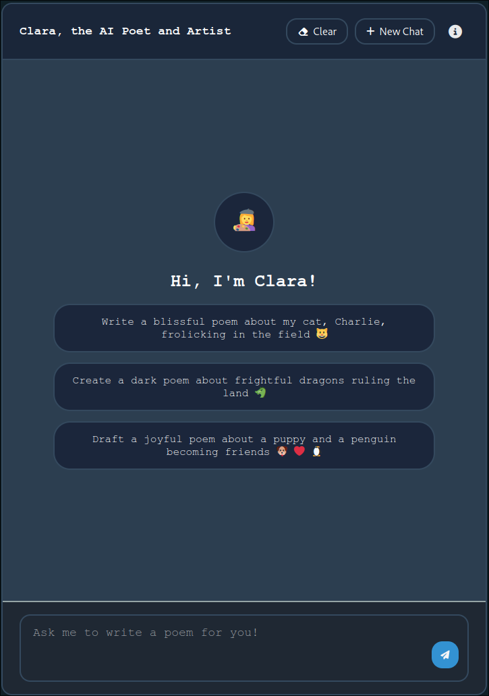
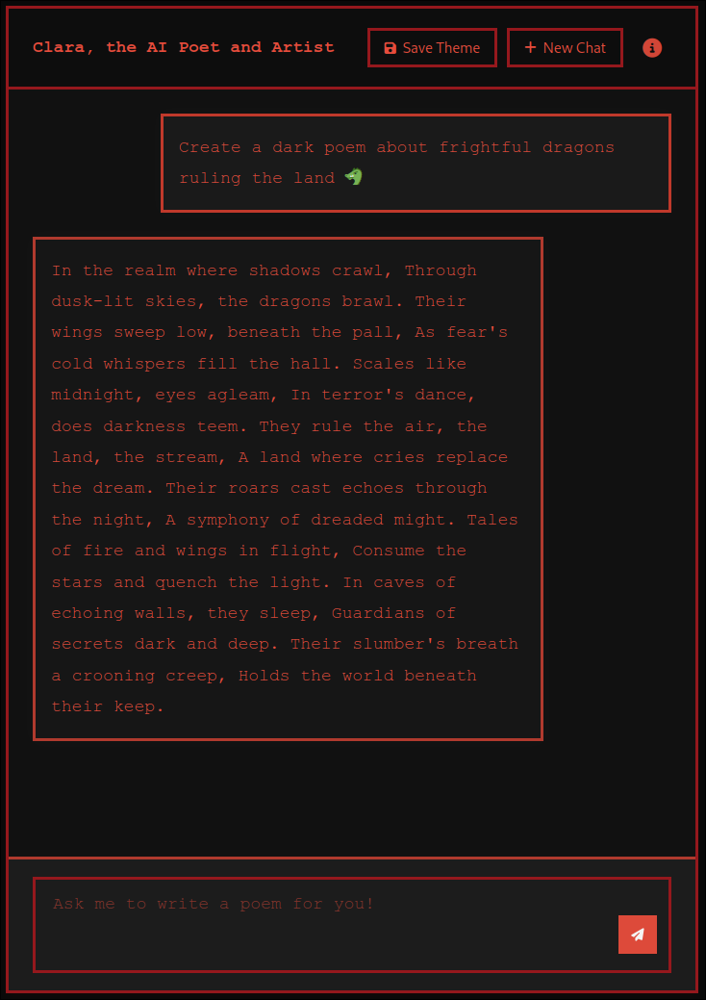
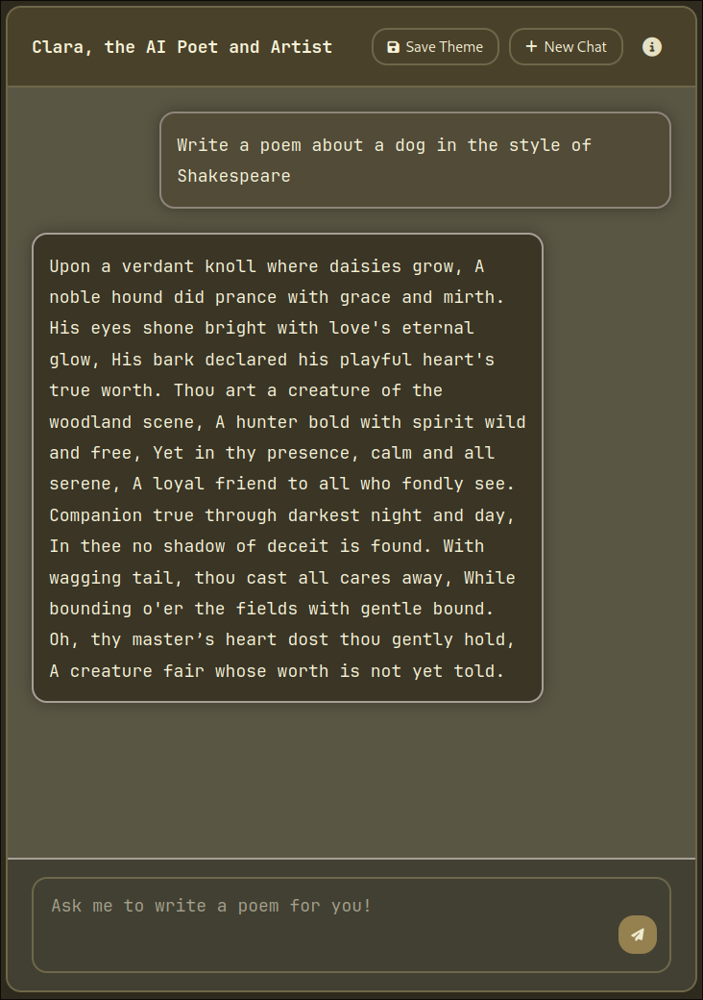
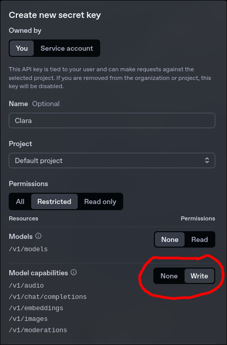

# Meet Clara, the AI Poet and Artist


Clara is an AI chat bot that responds in rhymes and can generate poems! When a poem is generated, the bot will dynamically change the theme of this page to reflect the theme of the poem.





## Try it out!

### API Key
To run this app locally, you will need an OpenAI API key with chat completion permissions.



Once you have an API key, set the environment variable `OPENAI_API_KEY` to the value of the API key. You can do this any way you like, but this repo does support `.env` files in both `.env` and `server/.env` locations, so you could set it up like this if that's easier:
```bash
echo 'OPENAI_API_KEY=<paste-token-here>' > .env
```

### Dependencies
This is a mono repo with a backend and frontend service.

#### Frontend
You will need `npm` to install dependencies. In this directory, run `npm install`.

#### Backend
You will need `cargo` for the backend dependencies. That's it :)

### Running
Now that you have dependencies installed, run just this one command to boot up both the frontend and the backend: `npm run dev`

That's it! Now visit `http://localhost:5173` in a browser! Have fun!

### Testing
To test the frontend, run `npm test` in this directory. To test the backend, navigate to the `server/` directory and run `cargo test`.

## Features
- Basic AI chat features, but Clara always speaks in rhymes!
- Clara, when prompted, will write a poem and change the theme of the chat bot webpage to match the poem's theme
- Themes can be saved across sessions! Just click the "Save Theme" button when you are not on the default theme, then refresh. The theme will still be there. This is saved using the browser's local storage feature.

## Known Deficiencies
The model runs slow when asking it for a poem, because of the size of the CSS file it needs to process to generate new styles. It's much faster if you just chat with it and don't ask for a poem. Still thinking of ways around the speed issue.

There is no image uploading feature.

## Deploy

### Using Docker Compose
Run `docker compose up --build` to see it run in the terminal, `docker compose up --build -d` to let it run in detached mode (so you can close your terminal while the app still runs). To shut it down once it's in detached mode, run `docker compose down`. If those commands fail, try `docker-compose` in place of `docker compose`, which is the way that some debian-based distros are set up. Once it's running, you can visit `http://localhost:49152` in a browser to try it out.

If you don't like the default port, you can set the `CLARA_PORT` env var to your desired port on the host machine. This env var won't do anything if set within the container. So you can use it like this: `env CLARA_PORT=5000 docker compose up` if you want to run on port 5000.

### Manually
The backend is configured to serve static files from `dist`, which is the directory that Vite builds the static files in by default. So all you need to do is run `npm run prod`. Vite will automatically build the static files, Cargo will compile the Rust backend in release mode, and the server will start running on port 49152. The server will serve the static frontend files. Visit `http://localhost:49152` once it is running to try it out.
